# Maya-Python-and-MEL

<!-- PROJECT LOGO -->
 

<h3 align="center">CODE SAMPLES</h3>

  

    SURYAPRAKASH HALWASIA
     
    <strong>This is for the University of Utah-Technical Art Track</strong>
     
    

 

<!-- MAYA PYTHON AND MEL SCRIPTS -->
## Maya Python and MEL Scripts

These scripts are created using the Maya commands library and MEL. These are the following
events handled by the scripts:

#### 1. Prefixer/Suffixer and Group Sorter

This script provides the option to the user to add prefixes/suffixes to all/selected objects in the scene.
The user can add a prefix/suffix based on the object type or provide a new one. Also, 
the objects can be grouped based on the type or suffix/prefix.

 
  

 

#### 2. Wheels Creator
This script provides the option to the user to provide a wheel mesh or use the basic low poly 
wheel to create four wheels of a car. These wheels can be positioned and scaled to fit
in the correct position using sliders. Finally, the user can finalize the setup to create controllers
to control the location and rotation of all the wheels as well as individually control the front and back wheels.

 
  

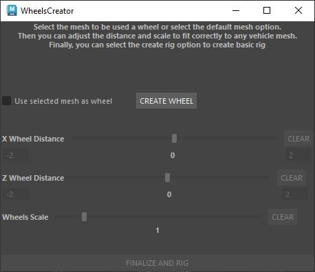

 
  

  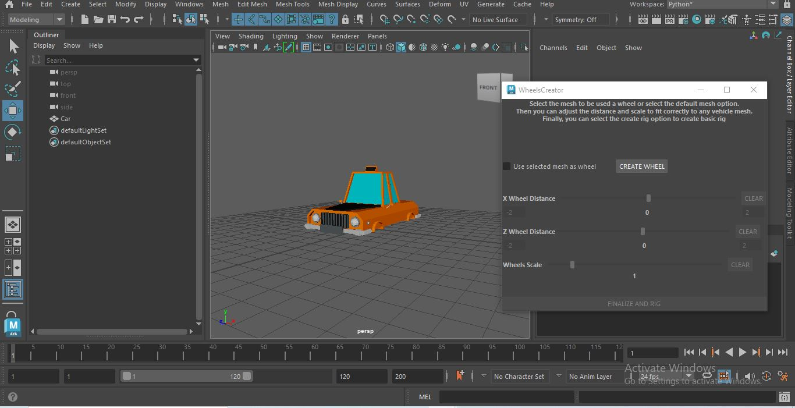

 
  

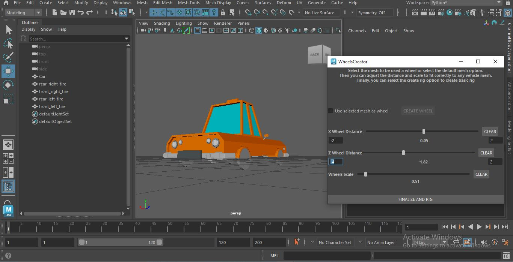

 
  

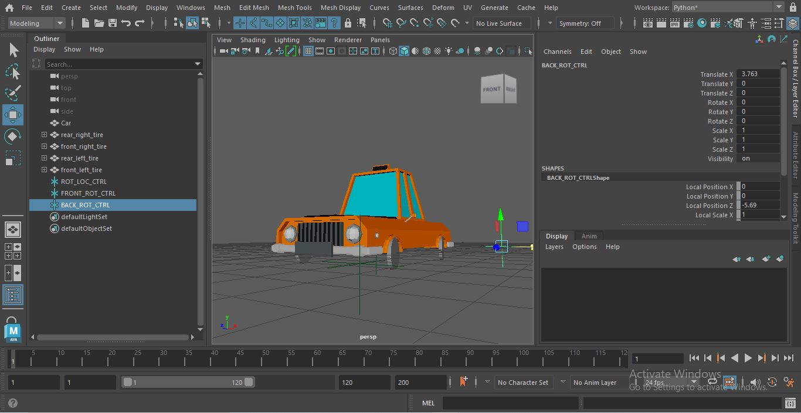

 

#### 3. Attributes Connector

This script allows the user to select a driver object and driven objects and connect the translation,
rotation, scale as well as other created attributes.

 
  

 
  

 

#### 4. Light Manager
This script allows the user to control all lights and their properties (color, intensity) in the scene as well as isolate the lights. 
Additionally, the user can also create new lights, delete existing ones and import/export the lighting
presets.

 
  

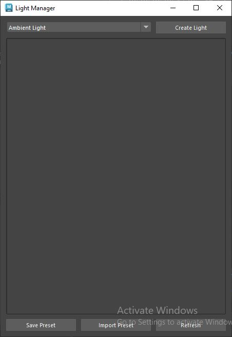

 
  

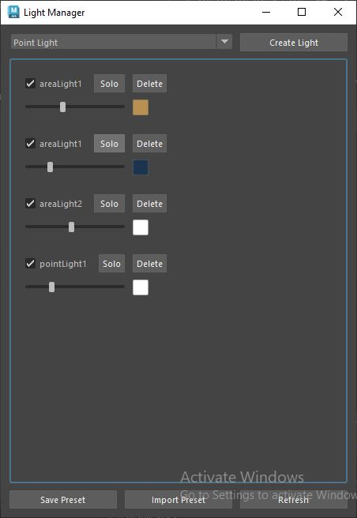

 

#### 5. Eyeball Creator
This script creates the eyeball (the cornea, iris and pupil) along with the materials and
allows the user the ability to position and scale them using sliders to the correct position. Also,
the user can adjust the color of the pupil and iris and finally create a controller to control
the rotation of the eyeball.

 
  

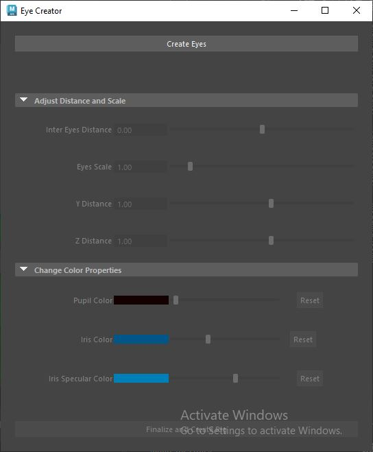

 
  

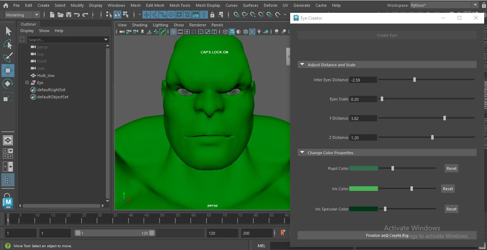

 
  

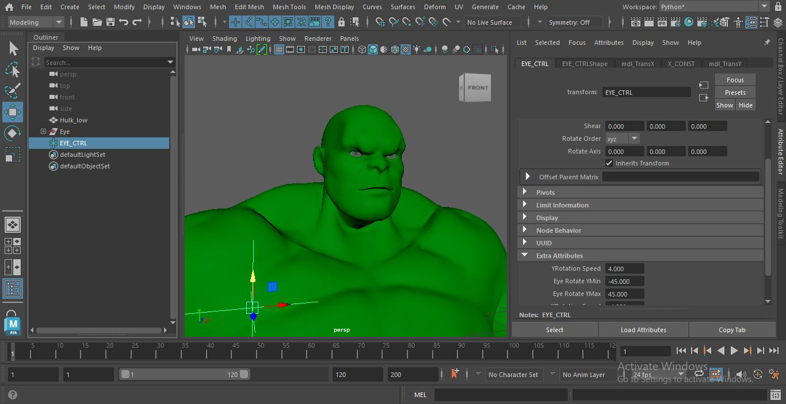
 

#### 6. FK IK Chains Creator
This script allows the user to provide joint chains to create the corresponding FK and IK chains
and provides a controller to blend them. It also creates controllers to control the chains as well
as the binding joints.

 
  

 
  

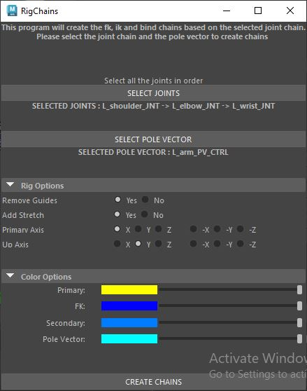

 
  

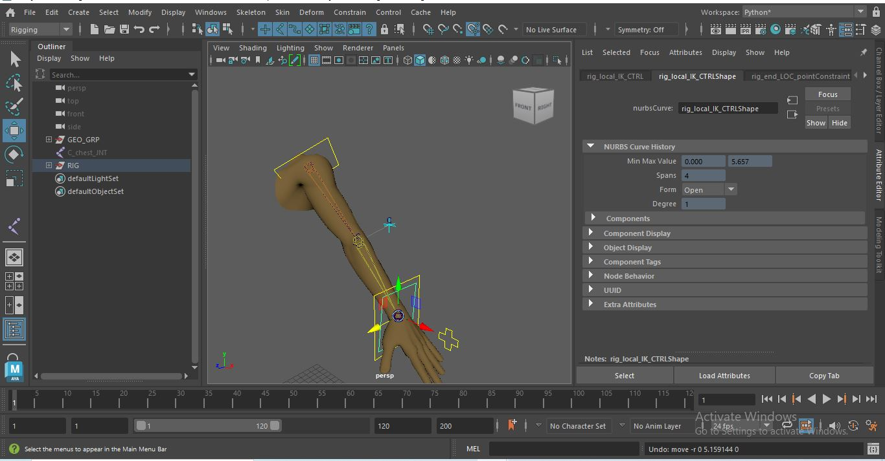

 
  

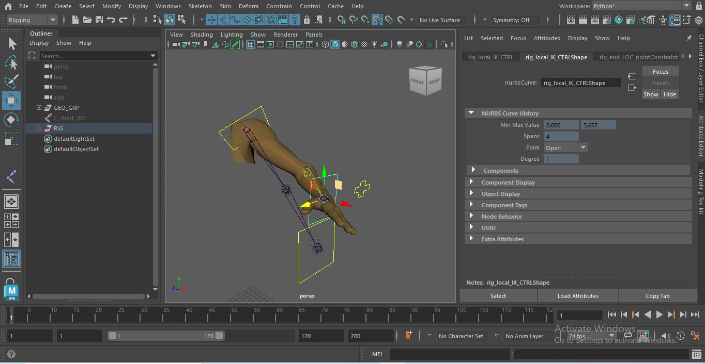
 
 

#### 7. Prefab Manager
This script allows the user to save the selected objects in the scene which can be imported into a scene.
Also, it displays the saved prefab with a screenshot for visual purposes.

 
  

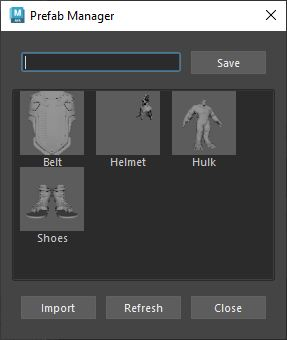
 
